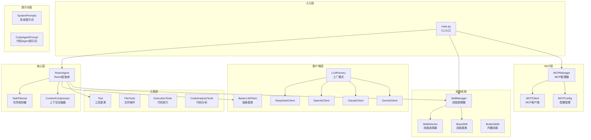
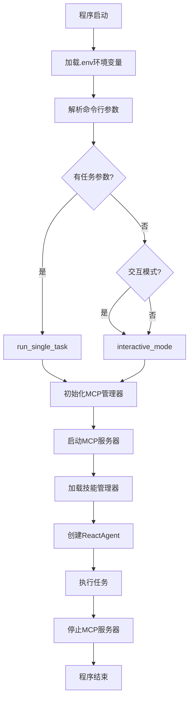
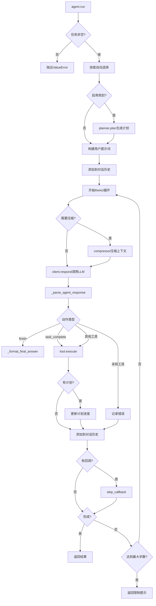
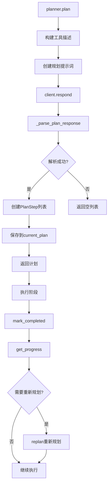
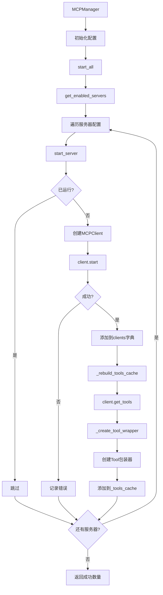
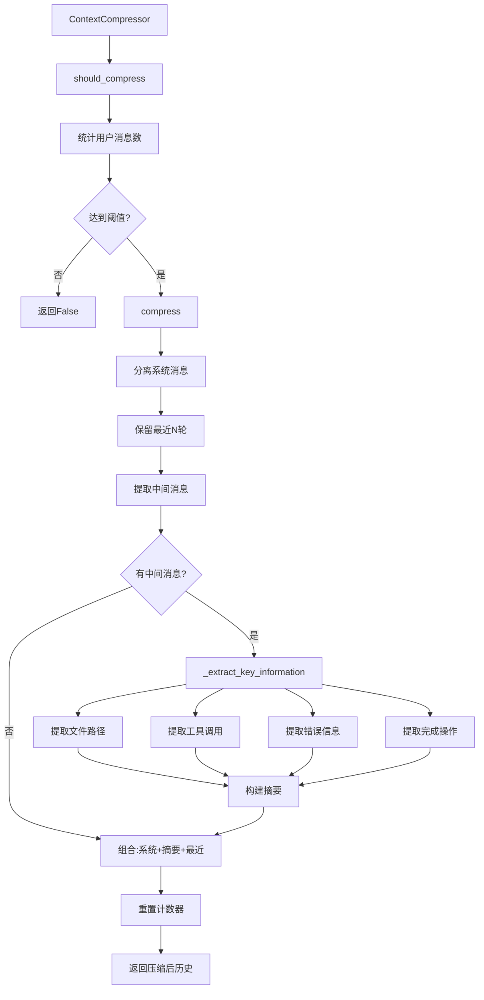
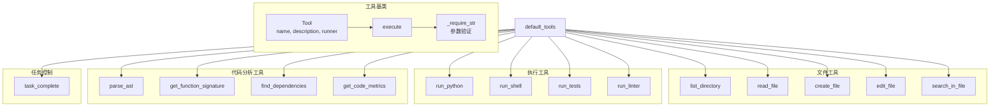
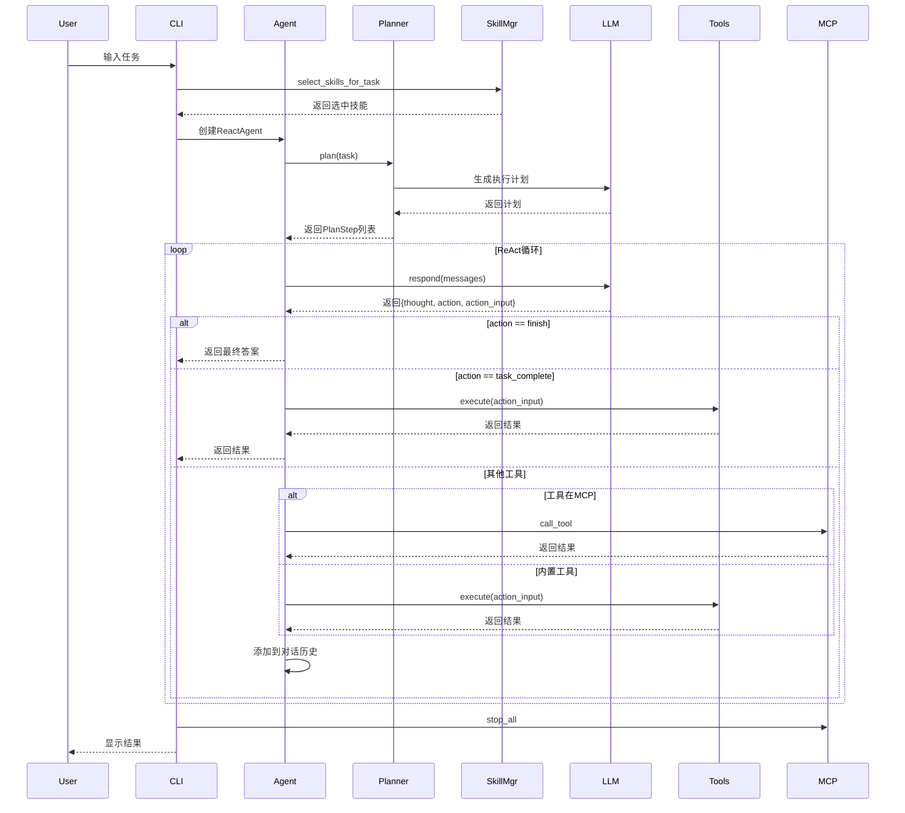
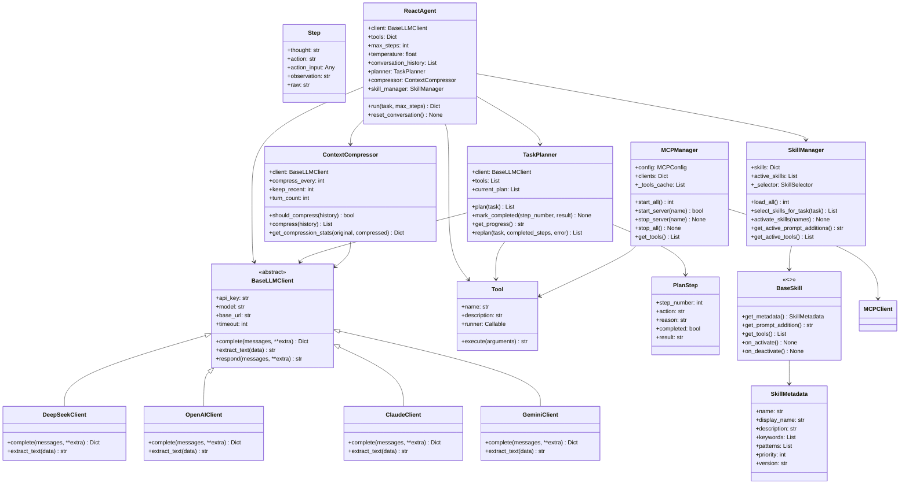

# DM-Code-Agent 架构分析文档

## 一、项目整体架构



## 二、模块详细分析

### 1. 入口层



### 2. ReactAgent 核心流程



### 3. TaskPlanner 任务规划器



### 4. 技能系统架构

```mermaid
flowchart TD
    subgraph "技能加载"
        A[SkillManager.load_all] --> B[load_builtin_skills]
        A --> C[load_custom_skills]
        B --> D[从builtin包加载]
        C --> E[扫描custom目录JSON]
        D' --> F[注册到skills字典]
        E' --> F
    end
    
    subgraph "技能选择"
        G[select_skills_for_task] --> H[SkillSelector.select]
        H --> I[_score_all计算分数]
        I --> J[_keyword_match关键词匹配]
        I --> K[_pattern_match正则匹配]
        J --> L[综合评分]
        K --> L
        L --> M{分数达标?}
        M -->|否| LLMFallback{启用LLM回退?}
        M -->|是| SortByScore[按分数排序]
        LLMFallback -->|是| _llm_select[LLM辅助选择]
        LLMFallback -->|否| ReturnEmpty
        _llm_select --> SortByScore
        SortByScore --> ReturnTop[返回前N个]
    end
    
    subgraph "技能激活"
        N[activate_skills] --> O[deactivate_all]
        O --> P[遍历选中技能]
        P --> Q[skill.on_activate]
        Q --> R[追加到active_skills]
    end
    
    subgraph "获取技能内容"
        S[get_active_prompt_additions] --> T[合并所有激活技能的prompt]
        U[get_active_tools] --> V[合并所有激活技能的工具]
    end
```



### 5. MCP 管理器架构



### 6. 上下文压缩器流程



### 7. 工具系统架构



## 三、数据流图



## 四、类关系图



## 五、关键设计模式

### 1. 工厂模式
**位置**: `dm_agent/clients/llm_factory.py`

`LLMFactory` 根据提供商名称创建不同的 LLM 客户端实例：
- `deepseek` → `DeepSeekClient`
- `openai` → `OpenAIClient`
- `claude` → `ClaudeClient`
- `gemini` → `GeminiClient`

### 2. 策略模式
**位置**: `dm_agent/skills/selector.py`

`SkillSelector` 使用多种策略选择技能：
- 关键词匹配策略（默认）
- 正则模式匹配策略（高权重）
- LLM 辅助选择策略（可选回退）

### 3. 模板方法模式
**位置**: `dm_agent/clients/base_client.py`

`BaseLLMClient` 定义算法骨架，子类实现具体步骤：
- `complete()`: 抽象方法，子类实现具体 API 调用
- `extract_text()`: 抽象方法，子类实现响应解析
- `respond()`: 模板方法，调用上述两个方法

### 4. 观察者模式
**`step_callback` 回调机制**

`ReactAgent` 通过 `step_callback` 实时通知外部执行状态：
- 在每个步骤执行后调用
- 可用于进度显示、日志记录等

### 5. 装饰器模式
**位置**: `dm_agent/mcp/manager.py`

MCP 工具包装器将外部 MCP 工具封装为内部 `Tool` 对象：
- 统一工具接口
- 透明调用外部工具

### 6. 单例模式
**位置**: `dm_agent/mcp/manager.py`

`MCPManager` 管理多个 MCP 服务器实例：
- 全局唯一的 MCP 管理器
- 统一管理所有 MCP 服务器生命周期

## 六、核心流程总结

### 1. 初始化流程
```
加载环境变量
    ↓
解析命令行参数
    ↓
初始化 MCP 管理器
    ↓
启动 MCP 服务器
    ↓
加载技能管理器
    ↓
创建 ReactAgent
    ↓
执行任务
```

### 2. 任务执行流程
```
技能自动选择
    ↓
生成执行计划（可选）
    ↓
进入 ReAct 循环
    ↓
思考 → 行动 → 观察
    ↓
判断是否完成
    ↓
返回结果
```

### 3. ReAct 循环
```
思考：分析当前状态
    ↓
行动：选择并执行工具
    ↓
观察：获取工具执行结果
    ↓
判断：是否完成任务？
    ↓
继续或结束
```

### 4. 上下文管理
```
每 N 轮对话检查
    ↓
是否需要压缩？
    ↓
提取关键信息：
  - 文件路径
  - 工具调用
  - 错误信息
  - 完成操作
    ↓
构建摘要
    ↓
保留最近 N 轮对话
    ↓
组合：系统消息 + 摘要 + 最近对话
```

### 5. 技能系统
```
加载技能（内置 + 自定义）
    ↓
任务文本分析
    ↓
自动选择相关技能
    ↓
激活选中技能
    ↓
追加技能提示词
    ↓
合并技能工具
    ↓
执行任务
```

### 6. MCP 集成
```
读取 MCP 配置
    ↓
启动启用的服务器
    ↓
获取服务器提供的工具
    ↓
包装为 Tool 对象
    ↓
缓存工具列表
    ↓
统一调用接口
    ↓
停止所有服务器
```

## 七、文件结构说明

```
DM-Code-Agent/
├── main.py                          # CLI 入口点
├── dm_agent/
│   ├── __init__.py
│   ├── core/                        # 核心模块
│   │   ├── agent.py                 # ReactAgent 实现
│   │   └── planner.py               # TaskPlanner 实现
│   ├── clients/                     # LLM 客户端
│   │   ├── base_client.py           # 抽象基类
│   │   ├── llm_factory.py           # 工厂函数
│   │   ├── deepseek_client.py
│   │   ├── openai_client.py
│   │   ├── claude_client.py
│   │   └── gemini_client.py
│   ├── tools/                       # 工具集
│   │   ├── base.py                  # Tool 基类
│   │   ├── file_tools.py            # 文件操作工具
│   │   ├── execution_tools.py       # 代码执行工具
│   │   └── code_analysis_tools.py   # 代码分析工具
│   ├── skills/                      # 技能系统
│   │   ├── base.py                  # BaseSkill 基类
│   │   ├── manager.py               # SkillManager
│   │   ├── selector.py              # SkillSelector
│   │   ├── builtin/                 # 内置技能
│   │   └── custom/                  # 自定义技能
│   ├── mcp/                         # MCP 集成
│   │   ├── manager.py               # MCPManager
│   │   ├── client.py                # MCPClient
│   │   └── config.py                # 配置管理
│   ├── memory/                      # 内存管理
│   │   └── context_compressor.py    # 上下文压缩器
│   └── prompts/                     # 提示词
│       ├── system_prompts.py
│       └── code_agent_prompt.py
├── config.json                      # 配置文件
├── mcp_config.json                  # MCP 配置
└── requirements.txt                 # 依赖列表
```

## 八、扩展指南

### 添加新的 LLM 客户端

1. 继承 `BaseLLMClient`
2. 实现 `complete()` 方法
3. 实现 `extract_text()` 方法
4. 在 `llm_factory.py` 中注册

### 添加新的工具

1. 在 `dm_agent/tools/` 中创建函数
2. 函数签名：`def tool_name(arguments: Dict[str, Any]) -> str`
3. 使用 `_require_str()` 验证参数
4. 在 `default_tools()` 中注册

### 添加新的技能

1. 继承 `BaseSkill` 或使用 `ConfigSkill`
2. 实现 `get_metadata()`、`get_prompt_addition()`、`get_tools()`
3. 放置在 `builtin/` 或 `custom/` 目录

### 添加新的 MCP 服务器

1. 在 `mcp_config.json` 中配置
2. 指定命令、参数、环境变量
3. 自动启动和管理
